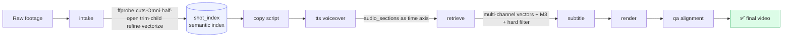

<div align="center">

<h1>🎬 Voah</h1>

<b>A CLI-first production kernel for short-form commerce videos</b><br/>
<sub>Intake · Semantic retrieval · Script · Voiceover · Subtitles · Render · QA — one command, 150 videos a day</sub>

<br/><br/>

<a href="./README.md">简体中文</a> ·
<a href="./README.en.md">English</a> ·
<a href="./README.ja.md">日本語</a>

<br/><br/>


</div>

---

## ✨ What is this

**Voah** distills the entire short-form commerce video workflow into a stable, replayable, observable `voah` command layer.

It's not "let AI cut one clip for you" — it's an **industrial batch-production kernel**: every asset is structurally ingested, vectorized, and retrieved by semantics; every finished video — script, voiceover, shot selection, subtitles, render, QA — is persisted, traceable, and resumable from any stage. The desktop app is just a shell; the real production power lives in the CLI. Whatever runs from the command line runs in the desktop app, in batch, or on a server.

> When a script says "pour-water test, makeup stays put," Voah retrieves the frame **where water is actually being poured** from your asset library — not a close-up that merely looks similar.

## 🧠 Principles

| Principle | Meaning |
|---|---|
| **CLI is the source of truth** | All business logic lives in the `voah` command layer — no second production path |
| **Artifacts before UI** | Every step is persisted to disk, never carried in process memory or UI state |
| **Traceable & resumable** | Each artifact records inputs/outputs/QA/next-consumers; resume from any stage |
| **Secrets never in artifacts** | API keys are read only from local private config — never written to manifests/logs/examples |
| **QA Gate guards export** | Duration, carry-frames, subtitle-source, shot alignment, Omni alignment must all pass |

## 🏗️ Pipeline



**Key design**: TTS first locks the real audio duration and segmentation, then footage is retrieved by audio semantics — the timeline follows the voiceover axis and never gets thrown off by post-hoc audio length.

## 🎯 Capabilities

- **🎞️ Intake**: ffmpeg scene cuts → Omni (Qwen3.5-Omni) story-unit understanding → child-level refinement → half-open trimming (carry-frame safe) → native video vectorization (Qwen3-VL-Embedding, 2560-dim)
- **🔍 Semantic retrieval**: multi-channel vectors (video/visual/meaning/ASR/OCR/tags) → MiniMax M3 selection → required_visual hard filter → child-level precise alignment
- **✍️ Script + voiceover**: MiniMax M3 scripting (char→duration calibration) → MiniMax TTS (Chinese reading normalization, marketing-number handling)
- **🔥 Subtitle render**: HyperFrames engineered captions (motion/highlight) + ffmpeg PNG overlay fallback, pixel-accurate wrapping with no overflow
- **🛡️ QA Gate**: duration, carry-frames, subtitle-source, coverage, Omni audio-visual alignment — fully validated
- **📦 Batch queue**: concurrency cap, single-failure isolation, resume, qualified-output export

## 🚀 Quick start

```bash
# 1. Environment check (toolchain + model keys)
node cli/src/bin/voah.js doctor --workspace .

# 2. Ingest footage
voah intake run --product my-product --source-dir ./footage/my-product --limit 3

# 3. One video
voah task create --product my-product --intake-run <intake_dir> --target-duration 30
voah task run <task_dir>

# 4. Batch
voah batch run --product my-product --intake-run <intake_dir> --count 20 --concurrency 3
```

Desktop (Electron workbench — low-cognitive UI for operators):

```bash
cd desktop/voah-studio && ./dev.sh
```

## 📟 Commands

```text
voah doctor                          environment check
voah config get|set                  local private config (keys never committed)
voah product create|list|inspect     product library
voah intake run                      ingest + structure + vectorize
voah task create|run [--from stage]  full pipeline / resume from stage
voah copy|tts|retrieve|subtitle|render|qa run   single-stage rerun
voah tts preview                     voiceover preview
voah batch run|pause|resume          batch queue
voah resource upload|cleanup         ephemeral OSS resource layer
```

## 🧩 Stack

| Layer | Tech |
|---|---|
| CLI orchestrator | Node.js (zero-dep, ≥20) |
| Workers | Python 3 (17 single-stage workers) |
| Desktop | Electron + Vite + React 19 + Tailwind + zustand |
| Video understanding | Qwen3.5-Omni-Plus |
| Vectorize / retrieve | Qwen3-VL-Embedding (2560-dim native video) |
| Script / selection | MiniMax M3 |
| Voiceover | MiniMax TTS |
| Subtitle render | HyperFrames + ffmpeg |

## 📂 Layout

```text
cli/        voah CLI (commands + core orchestration + services + schema)
scripts/    Python workers (intake/script/tts/retrieve/subtitle/render/qa)
desktop/    voah-studio desktop workbench (Electron + React)
docs/       engineering docs, design specs, methodology
tests/      tests
```

Developer onboarding and engineering docs: [`docs/AGENTS-onboarding.md`](./docs/AGENTS-onboarding.md) and [`docs/README.md`](./docs/README.md).

## 📄 License

[MIT](./LICENSE) © cutebug0523

<div align="center"><sub>Built for creators who ship at scale. 🚀</sub></div>
