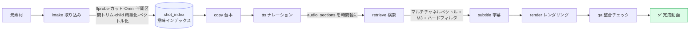

<div align="center">

<h1>🎬 Voah</h1>

<b>コマースショート動画のための CLI ファースト量産カーネル</b><br/>
<sub>取り込み · 意味検索 · 台本 · ナレーション · 字幕 · レンダリング · QA —— コマンド一つで 1 日 150 本</sub>

<br/><br/>

<a href="./README.md">简体中文</a> ·
<a href="./README.en.md">English</a> ·
<a href="./README.ja.md">日本語</a>

<br/><br/>


</div>

---

## ✨ これは何か

**Voah** は、コマースショート動画の制作フロー全体を、安定・再実行可能・観測可能な `voah` コマンド層へと凝縮したものです。

「AI に 1 本切ってもらう」のではなく、**工業的な量産カーネル**です。各素材は構造的に取り込まれ、ベクトル化され、意味で精密に検索されます。完成動画は台本・ナレーション・ショット選定・字幕・レンダリング・QA まで全工程がディスクに保存され、追跡可能で、任意の段階から再開できます。デスクトップアプリは単なる殻にすぎません。本当の制作能力は CLI にあり、コマンドラインで動くものはデスクトップでも、バッチでも、サーバーでも動きます。

> 台本が「水をかけてもメイクが崩れないテスト」と言えば、Voah は素材ライブラリから**実際に水をかけているフレーム**を検索します。似ているだけのアップではありません。

## 🧠 設計原則

| 原則 | 意味 |
|---|---|
| **CLI が正本** | すべての業務ロジックは `voah` コマンド層にあり、第二の制作経路は存在しない |
| **成果物が UI に先行** | 各ステップはディスクに保存され、プロセス内変数や UI 状態に依存しない |
| **追跡・再実行可能** | 各成果物が inputs/outputs/QA/次の消費者を記録し、任意の段階から再開可能 |
| **シークレットは成果物に入れない** | API キーはローカルの私的設定からのみ読み込み、manifest/ログ/例には決して書かない |
| **QA ゲートが門番** | 尺・コマ混入・字幕同源・素材整合・Omni 整合のすべてが通過してはじめて出力 |

## 🏗️ パイプライン



**核心設計**：TTS がまず実際の音声尺とセグメントを確定し、その後に音声の意味で素材を検索します。タイムラインはナレーション軸に沿うため、後付けの音声長に乱されません。

## 🎯 機能一覧

- **🎞️ 取り込み**：ffmpeg 視覚カット → Omni（Qwen3.5-Omni）story unit 理解 → child レベル精緻化 → 半開区間トリム（コマ混入防止）→ ネイティブ動画ベクトル化（Qwen3-VL-Embedding 2560 次元）
- **🔍 意味検索**：マルチチャネルベクトル（動画/映像/意味/ASR/OCR/タグ）→ MiniMax M3 選定 → required_visual ハードフィルタ → child レベル精密整合
- **✍️ 台本 + ナレーション**：MiniMax M3 執筆（文字数→尺キャリブレーション）→ MiniMax TTS（中国語読み正規化、マーケティング数値処理）
- **🔥 字幕レンダリング**：HyperFrames 工学的字幕（モーション/ハイライト）+ ffmpeg PNG オーバーレイのフォールバック、ピクセル単位の折り返しでオーバーフローなし
- **🛡️ QA ゲート**：尺・コマ混入・字幕同源・カバレッジ・Omni 音画整合をフル検証
- **📦 バッチキュー**：並列上限、単一失敗の隔離、再開、合格成果物リスト出力

## 🚀 クイックスタート

```bash
# 1. 環境チェック（ツールチェーン + モデルキー）
node cli/src/bin/voah.js doctor --workspace .

# 2. 素材取り込み
voah intake run --product my-product --source-dir ./footage/my-product --limit 3

# 3. 1 本制作
voah task create --product my-product --intake-run <intake_dir> --target-duration 30
voah task run <task_dir>

# 4. バッチ生産
voah batch run --product my-product --intake-run <intake_dir> --count 20 --concurrency 3
```

デスクトップ（Electron ワークベンチ — オペレーター向けの低認知負荷 UI）：

```bash
cd desktop/voah-studio && ./dev.sh
```

## 📟 コマンド一覧

```text
voah doctor                          環境チェック
voah config get|set                  ローカル私的設定（キーは非コミット）
voah product create|list|inspect     プロダクトライブラリ
voah intake run                      取り込み + 構造化 + ベクトル化
voah task create|run [--from stage]  全工程 / 段階から再開
voah copy|tts|retrieve|subtitle|render|qa run   単一段階の再実行
voah tts preview                     ナレーション試聴
voah batch run|pause|resume          バッチキュー
voah resource upload|cleanup         一時 OSS リソース層
```

## 🧩 技術スタック

| 層 | 技術 |
|---|---|
| CLI オーケストレーター | Node.js（依存ゼロ、≥20） |
| ワーカー | Python 3（17 個の単一段階ワーカー） |
| デスクトップ | Electron + Vite + React 19 + Tailwind + zustand |
| 動画理解 | Qwen3.5-Omni-Plus |
| ベクトル化 / 検索 | Qwen3-VL-Embedding（2560 次元ネイティブ動画） |
| 台本 / 選定 | MiniMax M3 |
| ナレーション | MiniMax TTS |
| 字幕レンダリング | HyperFrames + ffmpeg |

## 📂 リポジトリ構成

```text
cli/        voah CLI（コマンド + コアオーケストレーション + サービス + schema）
scripts/    Python ワーカー（取り込み/台本/tts/検索/字幕/レンダリング/qa）
desktop/    voah-studio デスクトップワークベンチ（Electron + React）
docs/       エンジニアリング文書、設計仕様、方法論
tests/      テスト
```

開発者向けオンボーディングとエンジニアリング文書：[`docs/AGENTS-onboarding.md`](./docs/AGENTS-onboarding.md) と [`docs/README.md`](./docs/README.md)。

## 📄 ライセンス

[MIT](./LICENSE) © cutebug0523

<div align="center"><sub>Built for creators who ship at scale. 🚀</sub></div>
